# Authority Barriers

Code and manuscript of the paper **_Explicit Two-Sided Viability Bounds for Safety Filters with
Configuration-Dependent Braking Authority_**.

A team of quadrotors carries a payload on cables toward a wall. A cable can pull and cannot push, so when every
cable leans toward the wall no tension can brake the payload: a quadrotor first has to swing to the far side. The
paper quantifies this delay. It shows when a high-order control-barrier-function (HOCBF) filter on the wall
distance must lose feasibility, and it constructs a safety certificate, the *authority barrier*, from the stopping
distance of an explicit swing-and-brake maneuver.

The repository contains the theory as a numerical library, a full-order simulation in Drake, computations of the
viability kernel, the experiments, the manuscript, and videos of sixteen recorded scenarios. Apart from the videos it
holds no results: every experiment writes its summaries, tables and figures to a results directory when it is run.

| To … | read |
|---|---|
| understand the code and the labels it uses for the statements of the paper | [`authority_barriers/README.md`](authority_barriers/README.md), then the README of each subfolder |
| run an experiment | [`authority_barriers/experiments/README.md`](authority_barriers/experiments/README.md) |
| build the paper | [`IEEE_ACC2027/README.md`](IEEE_ACC2027/README.md) |
| watch the simulation | [Videos](#videos) below, [`results/videos/README.md`](results/videos/README.md) |

## Research contribution

**Prior work the paper builds on** (as cited in the paper): HOCBFs for constraints of relative degree two and their
input-constrained variants; backup control barrier functions, which certify a safe set by simulating a backup
controller; wrench-feasibility analysis of cable robots; models of quadrotors carrying a cable-suspended payload;
viability theory.

**What the paper proposes.**

1. *Loss of feasibility* (Theorem 3). From an initially feasible state with every cable leaning toward the wall,
   an HOCBF filter on the wall distance becomes infeasible before any cable can reach the braking half-space, under
   a condition on the gains and the initial state.
2. *Authority barrier* (Definitions 5 and 7, Lemmas 6 and 8, Theorem 9, Propositions 12 and 13). The braking
   authority is the support function of a tension zonotope and depends on the cable directions. A time-optimal
   swing of every cable gives a stopping distance D in closed form. The set X_RF = {h ≥ D, swing states
   admissible} is controlled invariant for the continuous-time taut-cable model, and an optimistic stopping
   distance D_rel bounds the viability kernel from outside.
3. *Safety filter* (Eq. 17). A second-order cone program with one barrier row per maximizing time of the braking
   profile.

**What is realized here.** The library implements every definition and the filter; the experiments test the
theorems on the model for which they are stated and measure what happens outside it (sampled filter, attitude
loop, slack cables, wind, modeling errors).

### Where the novel contribution is implemented

| Contribution | Module |
|---|---|
| feasibility margin of the HOCBF filter, times t_ψ and τ (Theorem 3) | `authority_barriers/theory/hocbf.py` |
| directional authority and barrier data (Definition 5, Lemma 6) | `authority_barriers/theory/authority.py` |
| time-optimal swing profile (Eq. 11) | `authority_barriers/theory/profile.py` |
| stopping distance, maximizing times, exact gradients (Eq. 12, Proposition 13) | `authority_barriers/theory/stopping.py` |
| braking maneuver π♯ (Proposition 12) | `authority_barriers/theory/maneuver.py` |
| authority-barrier filter (Eq. 17) and its decomposition | `authority_barriers/theory/filters.py`, `socp.py` |

The model, the HOCBF and backup-CBF baselines, the Drake plant, the attitude controller, the level-set and
collocation solvers are standard methods or adaptations of them.

### Labels in the code

Comments, docstrings and the summaries that the experiments write cite the statements by the numbers of the
full-length manuscript on which the simulation study was planned: Thm. 5 is Theorem 3 of the paper, Thm. 12 is
Theorem 9, Prop. 17 is Proposition 13. [`authority_barriers/README.md`](authority_barriers/README.md), Sec. 0, has
the complete table.

## Experiments

One driver per experiment in `authority_barriers/experiments/`.

| Experiment | Tests | Label in the code | In the paper |
|---|---|---|---|
| E0 `e0_worked_example.py` | the numbers of the two-vehicle example | Sec. I, III | Sec. I and III |
| E1 `e1_thm5.py` | Theorem 3: the HOCBF filter loses feasibility before a cable can brake; three gain pairs, two actuator models, N = 4 and N = 3 | Thm. 5 | Sec. VI |
| E2 `e2_thm12i.py` | Theorem 9(i): invariance and feasibility of the authority-barrier filter under an adversarial nominal input | Thm. 12(i) | Sec. VI |
| E3 `e3_collocation.py` | Theorem 9(ii): smallest distance from which direct collocation finds a safe trajectory, against D_rel and D (N = 3) | Thm. 12(ii) | Sec. VI |
| E3 `e3_kernel.py`, E3b `e3b_kernel6d.py` | Theorem 9(ii): level-set viability kernels of the planar models with one and two cables | Thm. 12(ii) | not reported; see the known limitation below |
| E4 `e4_prop17.py` | Proposition 13: run time of D and of the filter for N = 2 to 8; decomposition of the barrier row | Prop. 17 | Sec. VI, run times |
| E5 `e5_robust.py` | barrier data reduced by a disturbance budget, under wind | Rem. 18 | not reported |
| E6 `e6_backup_compare.py`, `e6_distributed.py` | closed form against a numerically integrated backup filter; distributed filter with a lagged broadcast | Rem. 16, Prop. 17(b) | not reported |
| E7 `e7_stress.py`, `e7_corridor.py`, `e7_montecarlo.py` | limits of the guarantee: thrust sweep, mass error, soft cables, swing rates; corridor between two walls; Monte Carlo study with four filters | Sec. VI | not reported |

The results that the paper reports are in its Sec. VI. The figure files it includes are in `IEEE_ACC2027/figures/`;
[`IEEE_ACC2027/README.md`](IEEE_ACC2027/README.md) lists the result file from which each of them was taken.

**Known limitation.** The level-set kernel computations (`e3_kernel.py`, `e3b_kernel6d.py`) are not reliable at
speeds above about 2.4 m/s. In the runs made for the paper their boundary lay below the elementary bound
v²/(2 a_max z̄) on the stopping distance, by up to 1.6 m, so it is not a boundary of the viability kernel there.
The paper does not use these computations.

## Videos

Sixteen recorded scenarios, replayed in slow motion by `authority_barriers/experiments/trial_videos.py`. The close-up on the left is a
parallel projection from beside the payload with a camera that moves with it, the wall to the right: a cable to the right
of the vertical line through the payload leans toward the wall and cannot brake, a cable to its left is behind the payload.
[`results/videos/README.md`](results/videos/README.md) explains every part of the frame; each GIF links to the video in full
resolution (1920 x 1080, 30 frames per second).

**1. HOCBF filter: every cable leans toward the wall.** High-order control barrier function on the wall distance with the gains (k1, k2) = (0.5, 10). At the start every cable leans toward the wall, so no tension can brake the payload. The program of the filter is infeasible from t = 15 ms on, and the payload reaches the wall at 3.9 m/s.

[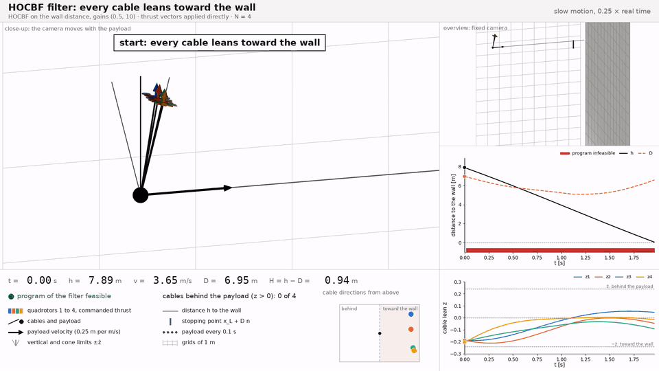](results/videos/e1_hocbf.mp4)

**2. Authority-barrier filter from the same initial state.** The initial state of the video e1_hocbf with the authority-barrier filter: every cable swings behind the payload, the team brakes, and the payload stops 0.06 m from the wall; in the 10 s of the trial its closest approach is 0.015 m.

[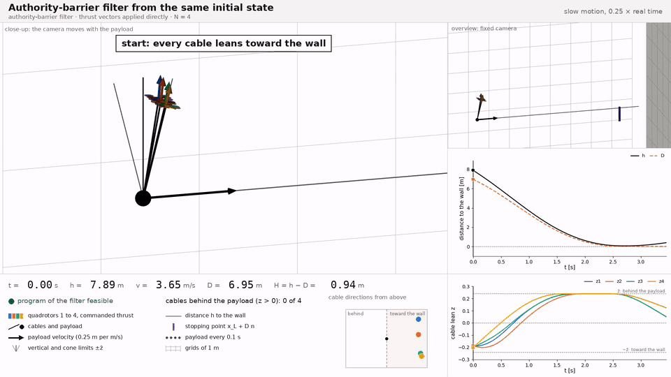](results/videos/e1_authority_barrier.mp4)

**3. Authority-barrier filter against full thrust toward the wall.** The nominal command is full thrust toward the wall. From the margin H(x0) = 0.77 m at 3.4 m/s the filter swings the cables behind the payload and brakes; the payload stops 0.06 m from the wall, and in the 15 s of the trial its closest approach is 0.0008 m. Among the trials of this set that stay off the wall it is the one that comes closest.

[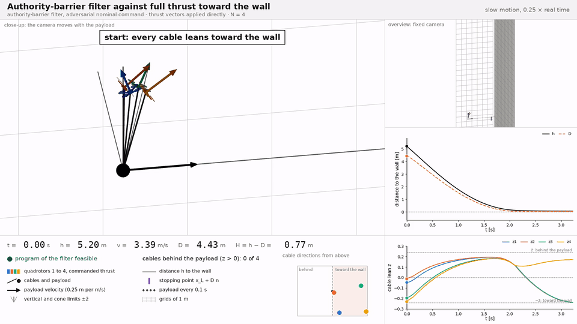](results/videos/e2_adversarial_command.mp4)

**4. Sampled filter started at the boundary of the safe set.** Initial state at the boundary of the safe set, H(x0) = 0.14 m. The barrier decreases between two samples of the 200 Hz filter, which the continuous-time condition does not see, and the payload reaches the wall at 0.48 m/s; the program of the filter is feasible at every sample.

[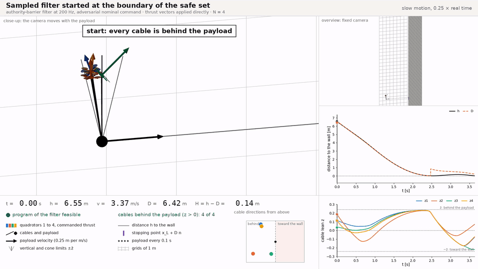](results/videos/e2_sampled_contact.mp4)

**5. Authority-barrier filter with the attitude loop.** A geometric attitude controller at 1 kHz tracks the commanded thrust vectors. Its tracking error reaches 43 N at the jumps of the command, the program of the filter is infeasible at 175 of 392 samples, and the payload reaches the wall at 0.02 m/s.

[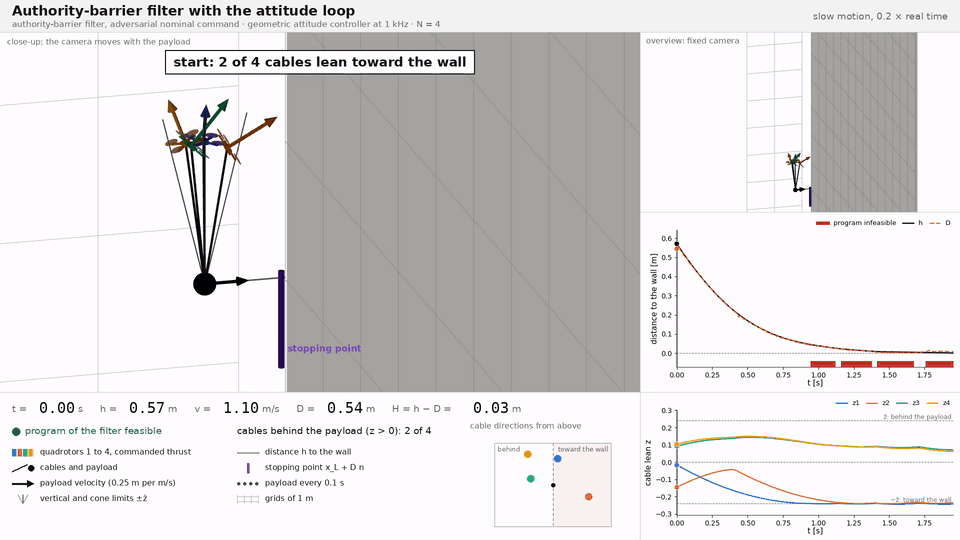](results/videos/e2_attitude_loop.mp4)

**6. Optimized trajectory with three vehicles.** Direct collocation with three vehicles, every cable leaning toward the wall at 4.0 m/s. The trajectory starts at h = 3.94 m, 0.52 of the stopping distance D = 7.65 m of the swing-and-brake maneuver, and ends after 0.81 s on the boundary of the safe set (H = 0.000 m). From there the video continues with the braking maneuver on the taut-cable model, which stops the payload at the wall, 0.1 mm in front of it.

[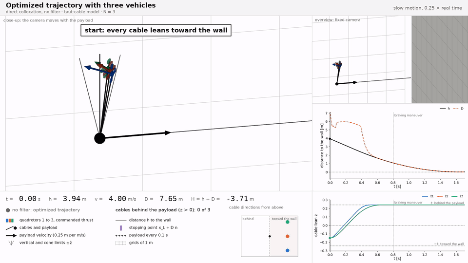](results/videos/e3_collocation.mp4)

**7. Robust filter under wind.** Wind bounded by the disturbance budget, barrier data reduced by that budget, adversarial nominal command. From 7.66 m at 3.6 m/s the payload stops 0.08 m from the wall; in the 15 s of the trial its closest approach is 0.066 m.

[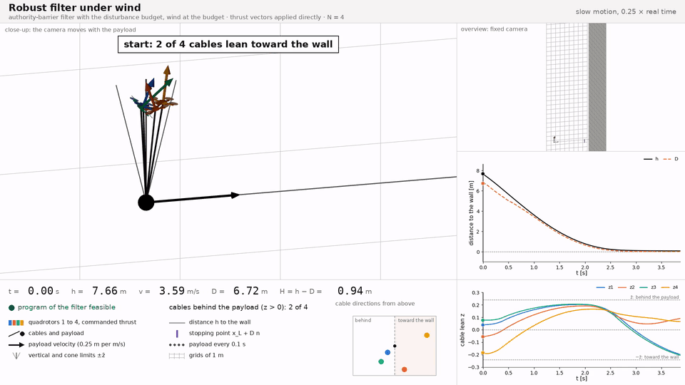](results/videos/e5_wind.mp4)

**8. Robust filter under wind: contact.** The setting of the video e5_wind from another initial state, 14.82 m at 3.9 m/s: the robust barrier is lost between two samples and the payload reaches the wall at 3.44 m/s.

[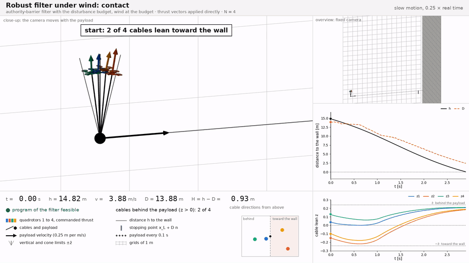](results/videos/e5_wind_contact.mp4)

**9. Distributed filter with a delayed broadcast.** Every vehicle solves its own program with the specific force of the payload broadcast one period late. The delayed value is not a commitment: the program of the filter is infeasible at 8 of 621 samples and the payload reaches the wall at 0.28 m/s. Of the 10 recorded trials, all end at the wall; the video shows the one that reaches it first.

[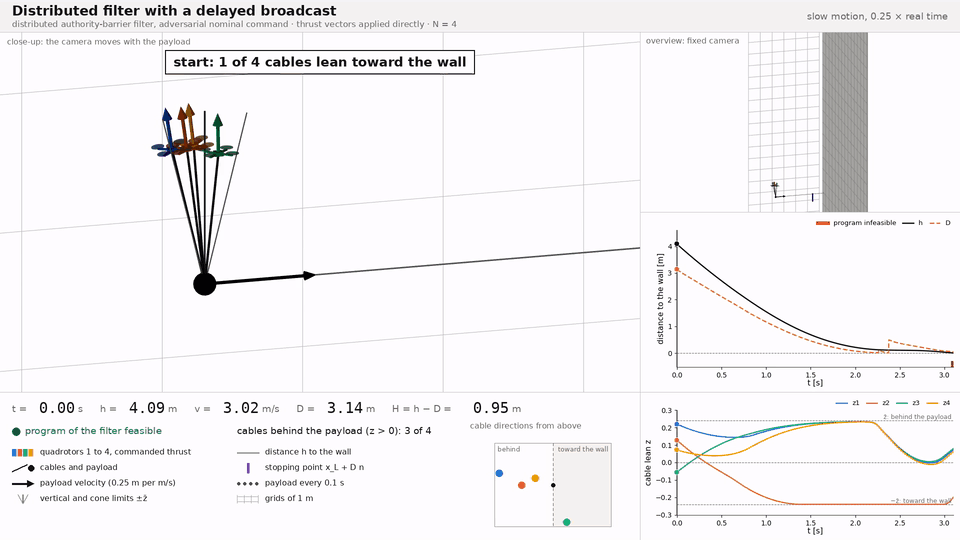](results/videos/e6_distributed.mp4)

**10. Transport through a corridor.** Two walls 20 m apart. The team flies along the corridor at 2.6 m/s and drifts toward one wall at 0.5 m/s; the nominal controller damps the drift and the filter leaves its command unchanged. The closest approach in the 15 s of the trial is 1.50 m. The camera looks along the corridor.

[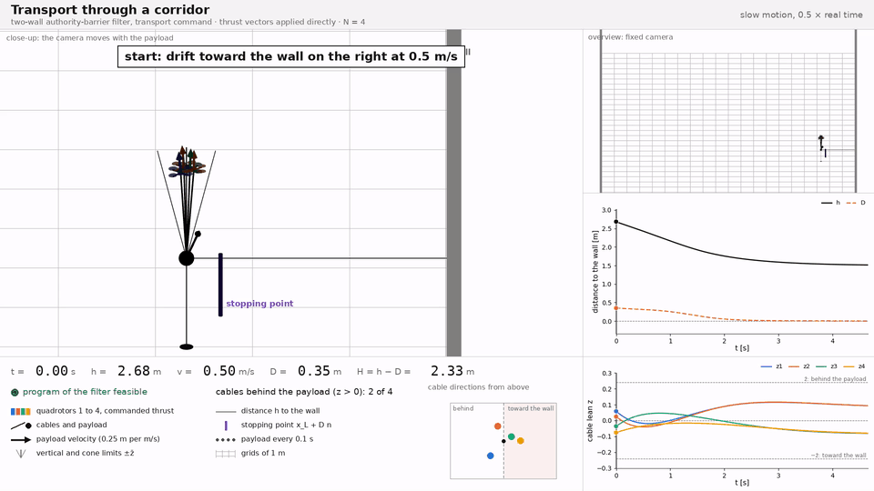](results/videos/e7_corridor.mp4)

**11. Transport toward the wall with modeling errors.** Monte Carlo trial 1269: thrust limit 41.9 N, payload of 0.89 kg against 1 kg in the model, gusts at 0.80 of the disturbance budget, transport toward the wall. With the authority-barrier filter the payload stops 0.13 m from the wall; in the 10 s of the trial its closest approach is 0.037 m.

[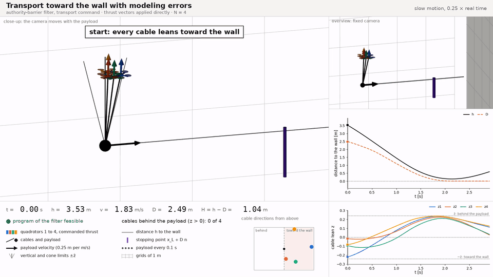](results/videos/e7_montecarlo.mp4)

**12. The same transport without a filter.** Monte Carlo trial 1269: thrust limit 41.9 N, payload of 0.89 kg against 1 kg in the model, gusts at 0.80 of the disturbance budget, transport toward the wall. Without a filter the payload reaches the wall at 2.35 m/s.

[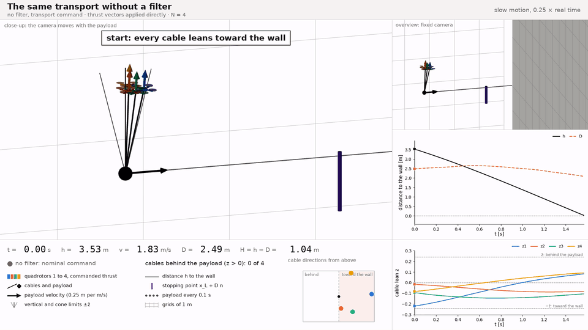](results/videos/e7_unfiltered.mp4)

**13. Thrust limit reduced to 20 N.** With a thrust limit of 20 N in place of 44 N the thrust reserve that the barrier assumes does not exist: the program of the filter is infeasible at 109 of 639 samples and the payload reaches the wall at 0.19 m/s. Of the 10 recorded trials, 1 ends at the wall, which is the one shown.

[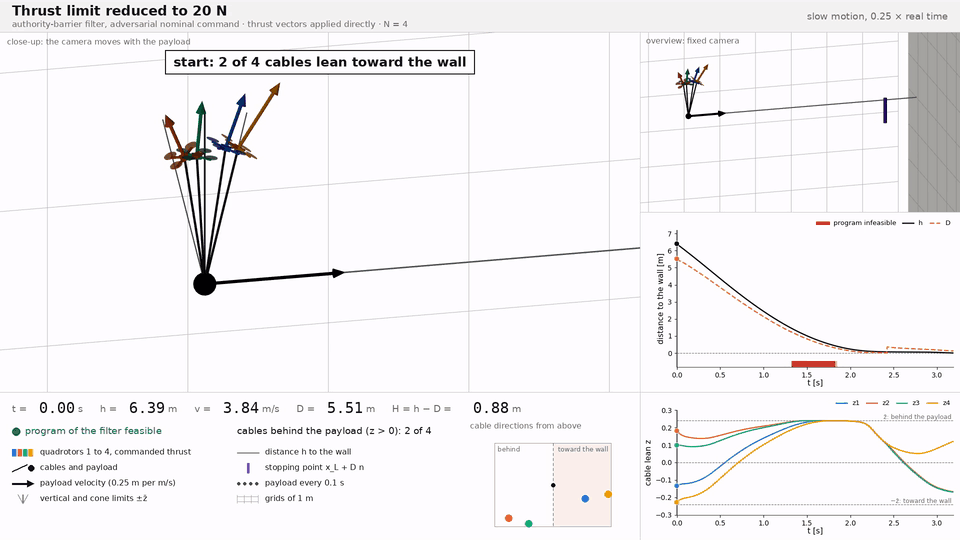](results/videos/e7_reduced_thrust.mp4)

**14. Payload 20 % heavier than the model.** The payload weighs 1.2 kg, the filter is designed for 1 kg. The payload reaches the wall at 0.70 m/s. Of the 20 recorded trials, all end at the wall; the video shows the first of them.

[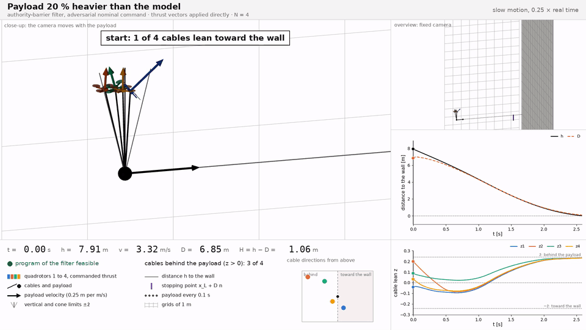](results/videos/e7_heavier_payload.mp4)

**15. Cables ten times softer.** Cable stiffness divided by ten. A cable is slack at 61 samples of the trial, which is outside the taut-cable model. The payload stops 0.06 m from the wall; in the 10 s of the trial its closest approach is 0.015 m. Of the 20 recorded trials, none ends at the wall; the video shows the one with the most samples with a slack cable.

[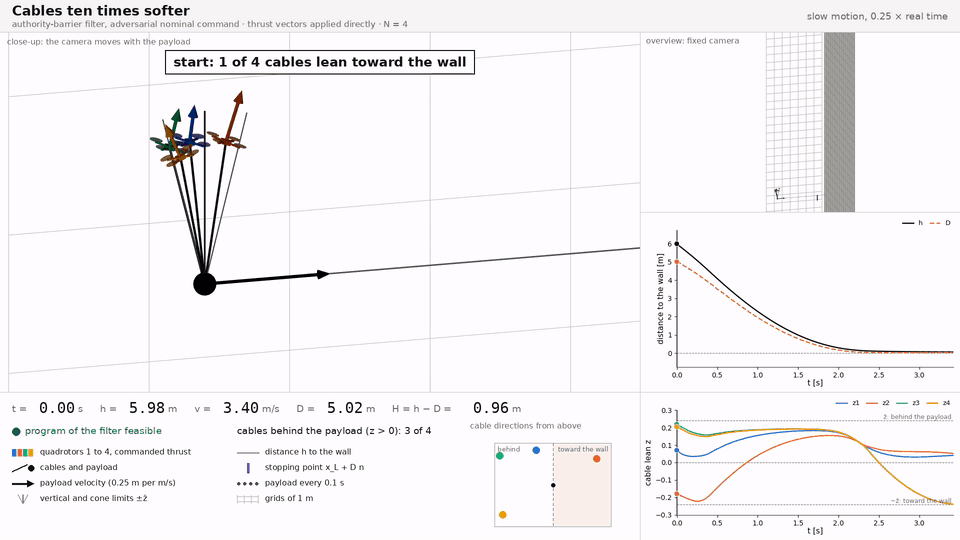](results/videos/e7_soft_cables.mp4)

**16. Swing rates above the operational limit.** The cables start with swing rates of 1.5 times the limit of the operational set, where the stopping distance is not defined: the program of the filter is infeasible at every sample and the payload reaches the wall at 3.50 m/s. Of the 20 recorded trials, 4 end at the wall; the video shows the one that reaches it last.

[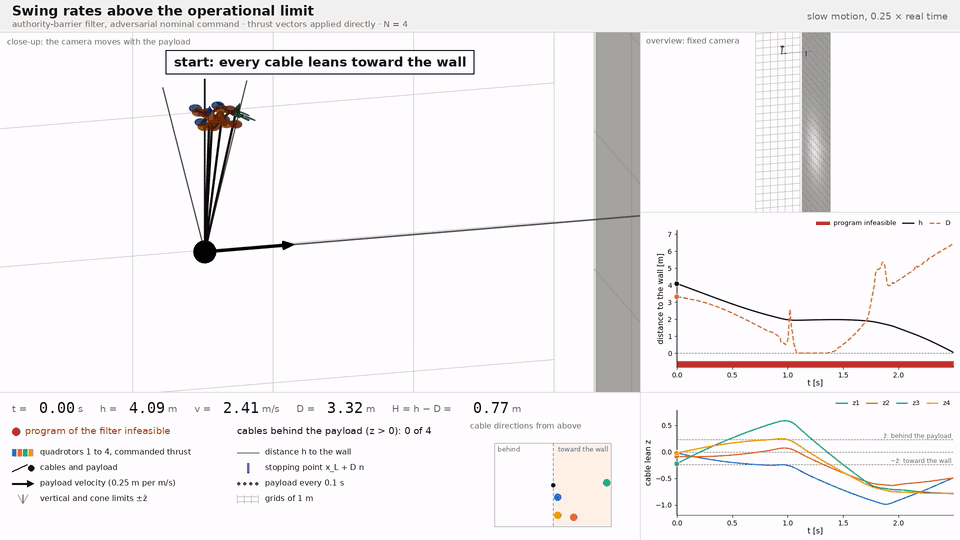](results/videos/e7_fast_swing.mp4)

## Repository map

```
authority_barriers/        the Python package
  theory/                  the definitions of the paper as code: model, swing profile, authority, maneuver,
                           stopping distance, filters and baselines, samplers, parameter sets
  simulator/               full-order Drake simulation: plant, cables, actuation, attitude loop, wind,
                           filter system, harness, recorder, renders
  viability/               viability kernels: level-set solvers, validation, cross-check, direct collocation
  experiments/             one driver per experiment (E0 to E7), shared helpers, figure and video generators
  configs/                 parameter sets (YAML) and their derived constants (JSON)
  reproduce.py             every experiment in one command
  gate.py                  lists the result files that each phase of the simulation study needs
IEEE_ACC2027/              the manuscript: main.tex, macros.tex, sections/, References.bib, figures/,
                           collect_figures.py, the IEEEtran class and bibliography style
scripts/                   build_paper.sh; run_*.sh, the sequences in which the experiments were launched
results/videos/            one video per scenario (MP4, GIF, one frame, sidecar), written by trial_videos.py
DevContainers/             submodule with the development container (.devcontainer links to it)
pyproject.toml, requirements.txt   the package and its dependencies; pinned versions of the environment
LICENSE
```

Written by a run and not part of the repository: the rest of `results/` (or the directory given with `--results` or
`SIM_RESULTS_DIR`), `results_smoke/`, `IEEE_ACC2027/build/`.

Every folder has a `README.md` that says what it contains, what it produces and how to read it.

## Quick start

```
# 1. environment: the dev container of the submodule DevContainers (Ubuntu 22.04, Python 3.10, pydrake 1.51.1)
pip install -e .                                         # extras: [viz] renders, [crosscheck] kernel cross-check

# 2. checks
python -m authority_barriers.experiments.e0_worked_example       # minimal example: the numbers of the paper's example
                                                         # (library example: authority_barriers/theory/README.md)
python -m authority_barriers.reproduce --all --smoke     # reduced run of every experiment, about 15 min, into results_smoke/

# 3. one experiment (writes results/core/e1_perfect/)
python -m authority_barriers.experiments.e1_thm5 --actuator perfect --workers 8

# 4. all experiments
python -m authority_barriers.reproduce --core --results results     # E0 to E5
python -m authority_barriers.reproduce --all  --results results     # adds E3b, E6, E7

# 5. figures from the results of step 4
python -m authority_barriers.experiments.make_figures --core
python -m authority_barriers.experiments.make_figures_optional

# 6. videos from the results of step 4 (extra [viz], ffmpeg): results/videos/
python -m authority_barriers.experiments.trial_videos
python -m authority_barriers.experiments.trial_videos --gif          # the GIF files shown in this README

# 7. paper
scripts/build_paper.sh                                   # IEEE_ACC2027/build/main.pdf
```

## Reproducibility

| Item | Value |
|---|---|
| Operating system, Python | Ubuntu 22.04.5 LTS, Python 3.10.12 |
| Simulator and solvers | pydrake 1.51.1 (MultibodyPlant, Clarabel, bundled SNOPT, DirectCollocation, Meshcat) |
| Packages | numpy 2.2.6, scipy 1.15.3, torch 2.14.0 (CPU), matplotlib 3.10.9, pyyaml 6.0.3; optional: jax 0.6.2, hj_reachability 0.7.0, playwright 1.63.0, pillow 12.3.0 |
| GPU | not used |
| LaTeX | TeX Live 2022, latexmk 4.76 |
| Video | ffmpeg 4.4.2 with libx264; Chromium of Playwright with software rendering |
| Environment variables | `SIM_RESULTS_DIR` (results root), `OMP_NUM_THREADS=1` for runs with several workers |
| Seeds | fixed in every driver |
| Outputs | `<results>/<track>/<experiment>/summary.md` and `results.json`; figures under `<results>/<track>/figures/`; videos under `<results>/videos/`; one log per step under `<results>/logs/` |
| Resuming | every driver skips the trials, collocation jobs and kernel states that are already on disk with the same configuration |
| Run times | about 14 h for E0 to E5 and 8 h more for E3b, E6, E7 on 8 threads (TODO: verify: sum of single steps, not timed in one run) |

### What was verified

In the environment above, on 2026-09-29:

| Check | Setting | Result |
|---|---|---|
| `python -m authority_barriers.reproduce --all --smoke` | a copy of the repository, no results directory | 27 steps, every step ok, 15 min |
| `scripts/build_paper.sh` | no results directory | builds without an undefined reference or citation |
| `python -m authority_barriers.experiments.trial_videos` | the results of the runs made for the paper | 16 videos, 230 s in total, 28 min; in every frame the payload, the vehicles and the thrust arrows lie inside the close-up |

Not verified: a full run of `reproduce --core` or `--all` in this structure; the rendered figures (`trial_figures`,
`sequence_figures`, `paper_figures`), which are not part of the reduced run; another operating system, machine or
version of pydrake.

## License

Apache License 2.0; see [`LICENSE`](LICENSE).
